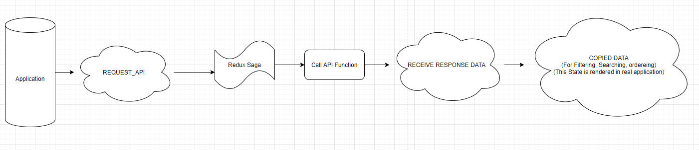
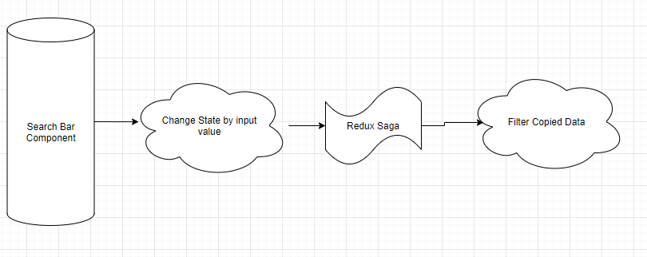

## Description
Channel Co. Pre-Task

## Requirement
- [x] react, webpack을 베이스로 사용하여 개발
- [x] 보일러 플레이트(create-react-app 등)를 사용하지 않아야 함.
- [x] 검색 창이 있어 통합 검색이 되어야 함. (Case insensitive, 부분일치)
- [x] 버튼을 누르면 각 필드별 오름차순, 내림차순 정렬이 되어야 함.
- [x] 각 나라의 데이터 Row에 삭제 버튼이 있어 누르면 삭제되어야 함.
- [x] 나라 정보를 입력해서 Row를 추가할 수 있어야 함.
- [x] 모든 상태(나라 목록, 정렬 상태, 검색어 등)는 데이터 관리 라이브러리(Redux, MobX 등)에 저장되어야 함.
- [x] Network 통신은 redux middleware를 통해 되어야 함.

## Extra Requirement
- [x] 일부만 로딩 후 스크롤 아래로 갈 시 추가 로딩
- [x] form 라이브러리(redux-form, formik 등) 사용
- [ ] cross browsing 적용
- [x] 검색 기능 (Rate limiting(debounce, throttle) 적용하여 타이핑 시 바로 검색)


## Initialization
```
1. git clone https://github.com/peppermint100/channel-pre-task
2. yarn or npm install
3. yarn start or npm start
```

## Libraries
- axios
- formik
- redux
- react-redux
- redux-saga
- styled-components

## Things I Learned
- need to put extra words in front of every single dispatch action to sort out of normal react functions
- remember not to mutate state in redux

## API Data State Management
 

1. Trigger Request Action in Application
2. Saga takes Actions then trigger saga function that calls API
3. Put fetched API Data in another store
4. Create and store another deep copied data to filter, search, order

## Copied Data
 Trying to find matching data directly causes a problem, which happens when user delete or change input value. because redux store lose original API Data(contains whole data). so I needed to store original data in another redux state, then create filtered data state for computing different filter options.




 ## Debouncing
 used lodash library

 ```tsx
 // input field
<Field
    component={TextInput}
    name="searchText"
    type="text"
    onChange={(e: React.ChangeEvent<HTMLInputElement>) => {
        debounce(e.target.value);
    }}
/>

// debounce
const debounce = useCallback(
    _.debounce((text: string) => {
    dispatch(setSearchBarText(text));
    }, 1000),
    []
);
 ```

reason that I use `useCallback` here is when input value changes, state get updated. that leads applications to be re-rendered again. which means re-defines whole functions in this component. so if we code debounce like this

```tsx
<Field
    component={TextInput}
    name="searchText"
    type="text"
    onChange={(e: React.ChangeEvent<HTMLInputElement>) => {
        _.debounce((text: string) => {
            dispatch(setSearchBarText(text));
        }, 1000)
    }}
/>

```

it won't work. because original debounce lost its reference. so I needed to memoize debounce function with `useCallback`

## Infinite Scroll
- memoize observer, `lastItemRef` with `useRef`, `useCallback`
- calculate last item in list with simple algorithm
- if observer reaches to last item
- change state of last item scope

## Improvable Points
- Better UI/UX design
- With limited showing data in `CountryLIst` component, I don't think I really have to compute whole data of the API. 
- cross browsing


